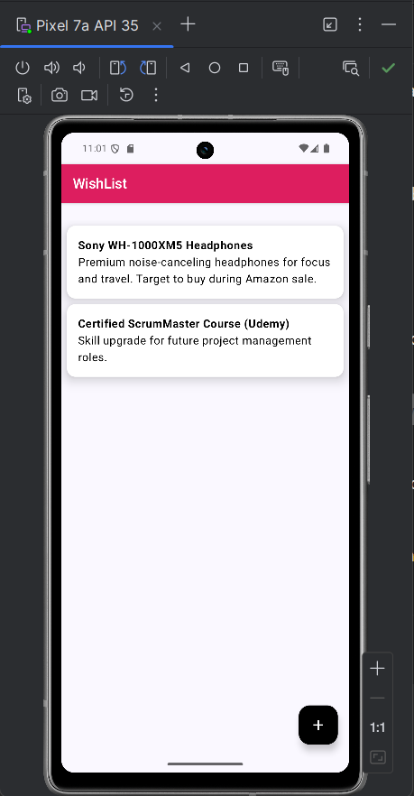
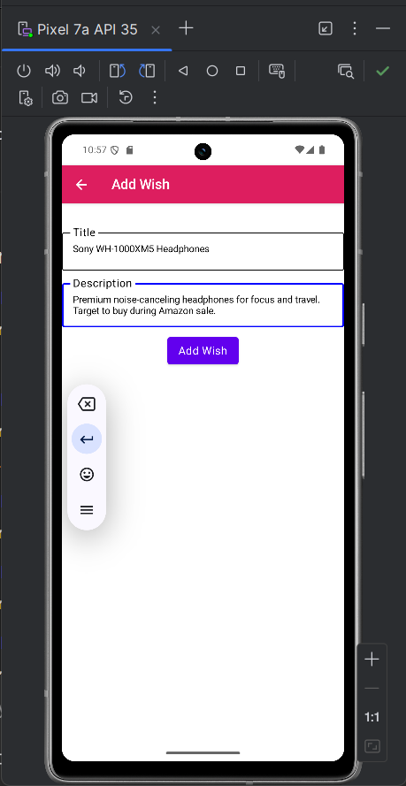
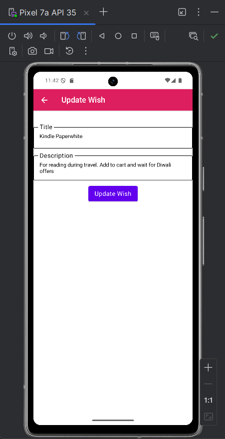
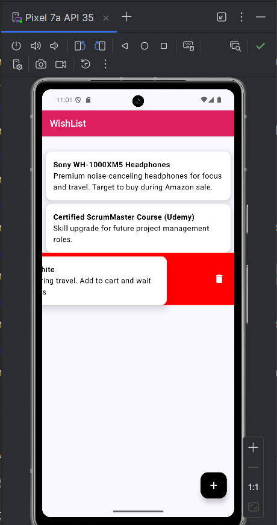

# 📱 Wishlist App – Jetpack Compose + Room

A minimalist and efficient Android application that helps users **manage and organize their wishlist items** in one place. Whether it’s products to buy, goals to achieve, or experiences to explore, the app ensures that users can keep track of their personal wishes with ease.

Built using modern Android development tools including **Jetpack Compose**, **Room Database**, and **MVVM architecture**, the app offers a **reactive, user-friendly, and maintainable experience**.

---

## 🚀 Features

- ✅ Add new wishlist items with title and description
- ✏️ Edit existing wishes anytime
- 🧹 Swipe-to-delete functionality with real-time UI updates
- 📂 Local data persistence using Room
- 🔁 Reactive UI with StateFlow and unidirectional data flow
- 🧱 Clean MVVM architecture with separation of concerns
- ♻️ Scalable and modular codebase following Android best practices

---

## 🛠️ Tech Stack

| Layer | Technology              |
|-------|--------------------------|
| UI    | Jetpack Compose          |
| Arch  | MVVM                     |
| State | StateFlow + ViewModel    |
| DB    | Room (SQLite abstraction)|
| Lang  | Kotlin                   |
| Build | Gradle                   |

---

## 🖼️ Screenshots

### 🏠 Home Screen
Displays all saved wishlist items in a vertically scrollable list.  

---

### ➕ Add Wish
Allows users to enter a title and description for a new wishlist item.  

---

### ✏️ Edit Wish
Users can tap on an existing item to modify its title or description.  

---

### 🗑️ Swipe to Delete
Swipe left or right on any item to instantly delete it with real-time UI updates.  

---